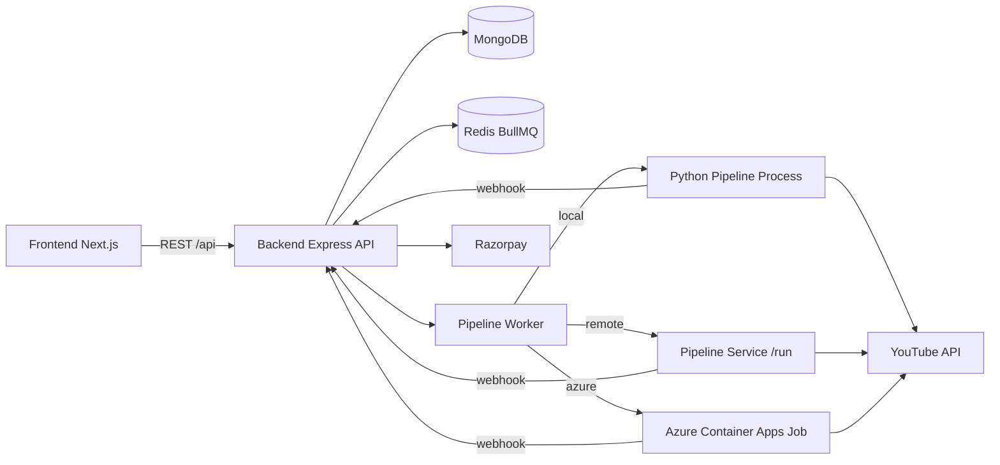

# ClipForge Project Documentation

## 1. What This Project Is

ClipForge is a SaaS platform for generating and optionally uploading YouTube Shorts using:

- A Next.js frontend dashboard
- An Express + TypeScript backend API
- A Python pipeline for script, audio, subtitles, rendering, and upload tasks
- MongoDB for persistent data
- Redis + BullMQ for background queues
- Razorpay for paid plan checkout and renewals

The product flow is:

1. User creates account and connects YouTube
2. User chooses content settings in dashboard
3. Frontend creates prompt and starts a pipeline job
4. Backend enqueues and processes the job in worker runtime
5. Python pipeline executes and sends webhook status updates
6. Backend finalizes job state, credits, and history

## 2. Repository Layout

Main folders in this repository:

- `frontend/`: Next.js app (UI, pages, client-side services)
- `backend/`: Express API, models, queue workers, auth, payment, scheduling
- `pipeline/`: Python runtime for media generation and YouTube upload flow
- `deploy/`: Azure deployment helper assets
- `scripts/`: helper scripts for local/codespace runtime
- `tests/`: Python tests
- `tools/ffmpeg/`: ffmpeg binaries/assets

## 3. High Level Architecture



## 4. Product Features

### 4.1 Content Creation Inputs

From dashboard, users can configure:

- Topic or prompt input mode
- Duration and video count
- Story mode with part progression
- Recap and CTA behavior
- Voice and style options
- Caption/template configuration
- Custom media selection (plan-gated)
- Scheduling or interval auto-upload settings
- Target YouTube channel

### 4.2 Plan and Feature Gating

Default plans (from backend config):

- `free`: limited channels and daily uploads, core features only
- `basic`: adds scheduling + more generation features
- `pro`: adds multi-channel, template customization, custom media
- `premium`: higher limits and same premium feature set with larger caps

Backend enforces plan restrictions before queuing jobs.

### 4.3 Payments

Active payment provider is Razorpay.

Implemented payment actions:

- Create checkout
- Confirm payment
- Renew subscription
- Convert plan (with remaining value handling)
- Handle Razorpay webhook with signature verification

Note: Some Stripe code remains in repository as legacy reference, but active checkout flow is Razorpay.

### 4.4 Scheduling and Auto Upload

Supported schedule types:

- one-time
- interval
- recurring

Scheduler behavior:

- Uses BullMQ delayed jobs when Redis is available
- Has lock and dedupe safeguards
- Includes startup seeding of orphaned schedules
- Falls back to DB polling mode when Redis is unavailable

### 4.5 Uniqueness and Anti-Repetition

System attempts to avoid repetitive content by combining:

- User recent topic memory in backend
- Sub-topic diversification before job enqueue
- Prepared content validation in pipeline
- Topic/hook/idea memory files in pipeline output state

## 5. Frontend (Next.js) Details

Location: `frontend/`

Stack:

- Next.js App Router
- React + TypeScript
- Tailwind CSS
- Framer Motion
- Firebase (push notification support)
- Axios for API calls

Key frontend service clients:

- `promptService`: calls `/prompt/generate`
- `pipelineService`: calls `/pipeline/run` and `/pipeline/jobs`
- `scheduleService`: calls `/schedules`
- `paymentService`: calls `/payment/create-checkout`, `/payment/confirm`, `/payment/renew`, `/payment/convert`
- `planService`: reads public/admin plan data

Realtime and notifications:

- Socket.io client is used for support/admin ticket messaging
- Firebase browser push support is integrated

## 6. Backend (Express + TypeScript) Details

Location: `backend/`

### 6.1 Core Middleware and Security

Main app behavior includes:

- Helmet with CSP configured for Razorpay domains
- CORS based on configured frontend origins
- Rate limiting at API and route-specific level
- Cookie parsing + CSRF protection
- Dedicated raw-body route for payment webhook verification
- Auth-protected route groups
- Centralized error handling

Webhook routing order is intentionally placed before CSRF middleware:

- `/api/payment/webhook` (raw body for signature validation)
- `/api/webhook/*` (pipeline status/complete callbacks)

### 6.2 Main API Route Groups

Backend route groups include:

- `/api/auth`
- `/api/youtube`
- `/api/prompt`
- `/api/pipeline`
- `/api/payment`
- `/api/schedules`
- `/api/media`
- `/api/plans`
- `/api/user`
- `/api/admin`
- `/api/support`
- `/api/notifications`
- `/api/banner`
- `/api/webhook`

Health endpoints:

- `GET /`
- `GET /health`

### 6.3 Job Lifecycle

Core job states:

- `pending`
- `processing`
- `success`
- `failed`

Important job fields:

- prompt/topic metadata
- generated script/captions/scenes
- chosen sub-topic
- channel id
- video count and processed videos
- hold flags for credit accounting
- webhook-updated logs and status

### 6.4 Queue and Worker Design

Queue uses BullMQ when Redis is configured.

- `pipelineQueue`: executes generation jobs
- `scheduleQueue`: delayed schedule execution

When Redis is missing:

- Queue objects degrade to NoopQueue
- Add operations return `503` queue-disabled errors
- Schedule runner can still run fallback scans, but queue-based scheduling features are limited

Worker runtimes for pipeline execution:

- `local`: starts Python process directly
- `remote`: calls pipeline service HTTP `/run`
- `azure`: triggers Azure Container Apps job and tracks execution status

Runner resolution priority:

1. `PIPELINE_RUNNER` env (`local|remote|azure`)
2. System config fallback
3. Auto fallback (`remote` if service URL exists, else `local`)

## 7. Python Pipeline Details

Location: `pipeline/`

Primary responsibilities:

- Content preparation and validation
- Audio generation
- Subtitle generation and burn-in
- Media composition and render steps
- Optional YouTube upload
- Webhook callback to backend for status and completion

### 7.1 Runtime Modes

Supported run modes:

- `prepared`
- `full`

Prepared mode is emphasized and legacy AI-only mode paths are disabled in code.

### 7.2 Webhook Contract

Pipeline sends status to backend endpoints:

- `/api/webhook/job-status`
- `/api/webhook/pipeline-complete`

Security and ownership checks include:

- `x-webhook-secret` verification
- job ownership validation by user id
- idempotency keys to prevent duplicate processing

### 7.3 Output and Asset Paths

Pipeline config centralizes paths for:

- generated audio
- subtitles
- output video
- uploaded/downloaded artifacts
- memory/history JSON files for topic/hook/idea reuse control

## 8. Data Model Summary

### 8.1 User

Stores:

- auth identity and provider
- plan/subscription state
- upload counters and holds
- connected YouTube channels and encrypted channel tokens
- per-channel last dashboard inputs
- recent topics memory for anti-repeat generation

### 8.2 Job

Stores:

- prompt and generation artifacts
- runtime config snapshot
- progress and logs
- final output links
- failure stage/message
- credit hold accounting fields

### 8.3 Schedule

Stores:

- schedule type and enable/running flags
- timing fields (`datetime`, `intervalHours`, `nextRunAt`)
- `videoConfig` payload used to launch scheduled job
- last run and error metadata

## 9. Environment Variables

### 9.1 Backend (`backend/.env`)

Core:

- `MONGO_URI`
- `JWT_SECRET`
- `FRONTEND_URL`

Auth and AI:

- `GOOGLE_CLIENT_ID`
- `GOOGLE_CLIENT_SECRET`
- `GOOGLE_REDIRECT_URI`
- `GEMINI_API_KEY`

Payment:

- `RAZORPAY_KEY_ID`
- `RAZORPAY_KEY_SECRET`
- `RAZORPAY_WEBHOOK_SECRET`
- `RAZORPAY_PLAN_AMOUNT_PAISE`
- `RAZORPAY_CURRENCY`

Queue and integrations:

- `REDIS_URL`
- `EMAIL_HOST`
- `EMAIL_PORT`
- `EMAIL_USER`
- `EMAIL_PASS`
- `TELEGRAM_BOT_TOKEN`

Pipeline bridge:

- `PIPELINE_RUNNER`
- `PIPELINE_SERVICE_URL`
- `PIPELINE_SERVICE_SECRET`
- `WEBHOOK_URL`
- `WEBHOOK_SECRET`
- `BACKEND_URL`

Azure runner:

- `AZURE_JOB_NAME`
- `AZURE_RESOURCE_GROUP`
- `AZURE_SUBSCRIPTION_ID`
- `AZURE_TENANT_ID`
- `AZURE_CLIENT_ID`
- `AZURE_CLIENT_SECRET`

### 9.2 Frontend (`frontend/.env.local`)

Required:

- `NEXT_PUBLIC_API_URL`

Optional Firebase vars (for push features):

- `NEXT_PUBLIC_FIREBASE_API_KEY`
- `NEXT_PUBLIC_FIREBASE_AUTH_DOMAIN`
- `NEXT_PUBLIC_FIREBASE_PROJECT_ID`
- `NEXT_PUBLIC_FIREBASE_STORAGE_BUCKET`
- `NEXT_PUBLIC_FIREBASE_MESSAGING_SENDER_ID`
- `NEXT_PUBLIC_FIREBASE_APP_ID`
- `NEXT_PUBLIC_FIREBASE_VAPID_KEY`

### 9.3 Pipeline (`pipeline/config/.env` or runtime env)

Critical runtime secrets:

- `GEMINI_API_KEY`
- `WEBHOOK_SECRET`
- `ENCRYPTION_KEY`

Common operational vars:

- `RUN_MODE`
- `WEBHOOK_URL`
- `BACKEND_URL`
- `PIPELINE_PYTHON_CMD`
- YouTube token/client secret paths

## 10. Local Development Runbook

### 10.1 Prerequisites

- Node.js >= 20 for frontend
- Python >= 3.10 for pipeline
- MongoDB
- Redis (strongly recommended for full functionality)

### 10.2 Install

```bash
# root
npm install

# backend
cd backend
npm install

# frontend
cd ../frontend
npm install

# pipeline
cd ../pipeline
python -m venv .venv
.venv\Scripts\activate
pip install -r requirements.txt
```

### 10.3 Start Services

Backend API:

```bash
cd backend
npm run dev
```

Frontend:

```bash
cd frontend
npm run dev
```

Optional dedicated worker process:

```bash
cd backend
npm run worker
```

Important note: backend server also imports pipeline worker module on startup. If you run a separate worker process at the same time, validate your concurrency strategy to avoid duplicate consumers.

## 11. Deployment Patterns

### 11.1 Single Host Basic Setup

- Deploy frontend and backend separately
- Keep Redis and Mongo managed externally
- Use local runner for pipeline if host has Python/ffmpeg

### 11.2 Azure Job Runner Setup

- Set `PIPELINE_RUNNER=azure`
- Configure Azure env vars and identity credentials
- Worker dispatches Azure Container Apps jobs per request

### 11.3 Remote Pipeline Service Setup

- Run `pipeline/scripts/run_pipeline_service.py` as dedicated service
- Set backend to `PIPELINE_RUNNER=remote`
- Set `PIPELINE_SERVICE_URL` and shared secret

## 12. Operational Notes and Known Caveats

- Some docs still mention Stripe env vars. Active payment path is Razorpay.
- Redis is essential for reliable queue behavior in production.
- Webhook secrets must match between backend and pipeline runtime.
- YouTube upload flow depends on valid per-channel tokens and ownership checks.
- Plan gates are enforced in backend, not only frontend UI.
- Job and webhook handling includes idempotency logic to reduce duplicate mutations.

## 13. Practical End-to-End Scenario

A typical run from dashboard to publish:

1. User chooses channel, topic/prompt, duration, and style options.
2. Frontend calls `/prompt/generate` and then `/pipeline/run`.
3. Backend validates plan limits, channel ownership, and upload constraints.
4. Backend reserves upload credits and creates a job record.
5. Worker generates prepared content and dispatches pipeline runtime.
6. Pipeline sends progress and completion webhooks.
7. Backend finalizes job, consumes/releases held credits, and stores output URLs.
8. User checks status in `/pipeline/jobs` from dashboard.

## 14. Where To Look First (Developer Quick Index)

- App bootstrap and middleware: `backend/src/app.ts`
- Server startup and bootstrap tasks: `backend/src/server.ts`
- Pipeline run API and queue entry: `backend/src/controllers/pipelineController.ts`, `backend/src/services/pipelineRunService.ts`
- Worker orchestration: `backend/src/workers/pipelineWorker.ts`
- Scheduling: `backend/src/controllers/scheduleController.ts`, `backend/src/workers/scheduleRunner.ts`
- Payment flow: `backend/src/controllers/paymentController.ts`, `backend/src/services/razorpayService.ts`
- Webhook lifecycle: `backend/src/controllers/webhookController.ts`
- Dashboard orchestration: `frontend/src/app/dashboard/page.tsx`
- Python pipeline entry points: `pipeline/src/youtube_ai_automation/main.py`, `pipeline/src/youtube_ai_automation/execution_runner.py`

---

If you want, the next step can be a second document with only diagrams and API tables for onboarding new developers faster.
