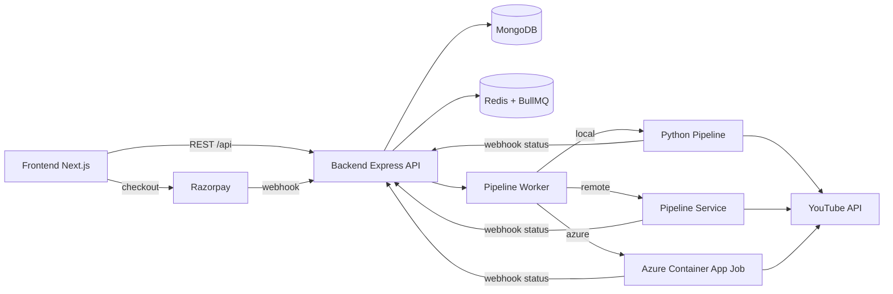

<p align="center">
	
</p>

<p align="center">
	
</p>

<p align="center">
	<a href="#quick-start"></a>
	<a href="#architecture"></a>
	<a href="#production-deployment"></a>
</p>

## Overview

ClipForge is a production-ready AI video automation SaaS that combines:

1. A modern Next.js dashboard for operators.
2. An Express + TypeScript backend API for auth, plans, billing, and orchestration.
3. A Python pipeline runtime for content generation, subtitle rendering, and YouTube upload.

Core capabilities:

1. Google OAuth login and YouTube channel connect.
2. Prompt and topic based short-video generation.
3. Story mode with multi-part progression.
4. Queue-powered async execution with resilient webhook updates.
5. Razorpay subscription lifecycle and plan feature gating.
6. Scheduling and auto-upload intervals.

## Table Of Contents

1. [Architecture](#architecture)
2. [Repository Structure](#repository-structure)
3. [Tech Stack](#tech-stack)
4. [Quick Start](#quick-start)
5. [Environment Variables](#environment-variables)
6. [Runbook (Dev Commands)](#runbook-dev-commands)
7. [Production Deployment](#production-deployment)
8. [Google OAuth Setup](#google-oauth-setup)
9. [Troubleshooting](#troubleshooting)
10. [Testing And Quality](#testing-and-quality)
11. [Security Notes](#security-notes)

## Architecture



## Repository Structure

```text
.
|- frontend/        # Next.js dashboard (App Router)
|- backend/         # Express API (brain) + shared worker modules
|- worker/          # Worker-only deployment assets (Docker, env template, runbook)
|- pipeline/        # Python media generation runtime
|- tests/           # Python tests
|- deploy/          # Cloud deployment assets
|- scripts/         # Local and codespace helper scripts
|- tools/ffmpeg/    # ffmpeg bundle/assets
|- requirements.txt # Root Python install entry
```

## Tech Stack

Frontend:

1. Next.js 16
2. React 19
3. Tailwind CSS 4
4. Framer Motion

Backend:

1. Node.js + TypeScript
2. Express 5
3. MongoDB (Mongoose)
4. Redis + BullMQ
5. Google APIs + Razorpay

Pipeline:

1. Python 3.10+
2. google-api-python-client
3. yt-dlp
4. requests + tenacity

## Quick Start

Prerequisites:

1. Node.js 20+
2. Python 3.10+
3. MongoDB
4. Redis

### 1) Install project dependencies

```bash
npm install
cd backend && npm install
cd ../frontend && npm install
cd ..
```

### 2) Install Python dependencies from repo root

```bash
python -m venv .venv
```

Windows:

```bash
.venv\Scripts\activate
pip install -r requirements.txt
```

macOS/Linux:

```bash
source .venv/bin/activate
pip install -r requirements.txt
```

### 3) Configure environment files

1. Create backend env at backend/.env
2. Create frontend env at frontend/.env.local
3. Fill variables from the environment section below

### 4) Start services

Terminal A (backend API):

```bash
cd backend
npm run dev
```

Terminal B (backend worker):

```bash
cd backend
npm run worker
```

Terminal B alternative (worker-only docker runtime):

```bash
cd worker
cp .env.example .env
docker compose -f docker-compose.build.yml up -d --build
```

Terminal C (frontend):

```bash
cd frontend
npm run dev
```

## Environment Variables

### Backend required

Core:

1. PORT
2. MONGO_URI
3. JWT_SECRET
4. FRONTEND_URL
5. FRONTEND_URLS
6. BACKEND_URL
7. REDIS_URL

Google/YouTube:

1. GOOGLE_CLIENT_ID
2. GOOGLE_CLIENT_SECRET
3. YOUTUBE_CLIENT_ID
4. YOUTUBE_CLIENT_SECRET

AI and pipeline:

1. GEMINI_API_KEY
2. WEBHOOK_SECRET
3. WEBHOOK_URL
4. PIPELINE_RUNNER (local, remote, or azure)
5. PIPELINE_PYTHON_CMD

Billing and notifications:

1. RAZORPAY_KEY_ID
2. RAZORPAY_KEY_SECRET
3. RAZORPAY_WEBHOOK_SECRET
4. EMAIL_HOST
5. EMAIL_PORT
6. EMAIL_USER
7. EMAIL_PASS

### Frontend required

1. NEXT_PUBLIC_API_URL

Example:

```bash
NEXT_PUBLIC_API_URL=https://api.clipforgeapp.tech/api
```

## Runbook (Dev Commands)

From repository root:

```bash
npm run preflight
npm run preflight:ci
```

Backend:

```bash
cd backend
npm run dev
npm run build
npm run start
npm run worker
npm run start:worker
```

Worker-only deployment assets:

```bash
cd worker
docker compose -f docker-compose.build.yml up -d --build
docker compose logs -f clipforge-worker
```

Frontend:

```bash
cd frontend
npm run dev
npm run build
npm run start
npm run lint
```

Python tests:

Windows:

```bash
.venv\Scripts\activate
pip install -r requirements-dev.txt
set PYTHONPATH=pipeline/src
python -m pytest -q tests
```

macOS/Linux:

```bash
source .venv/bin/activate
pip install -r requirements-dev.txt
PYTHONPATH=pipeline/src python -m pytest -q tests
```

## Production Deployment

Recommended split:

1. Frontend on Vercel.
2. Backend API on DigitalOcean App Platform.
3. Worker as separate service using the `worker/` folder runtime.
4. Managed MongoDB and Redis.

### Required production rules

1. HTTPS only.
2. Exact CORS allowlist domains in FRONTEND_URLS.
3. No trailing/leading spaces in env values.
4. API and worker must share the same backend env values.

### Vercel frontend env

```bash
NEXT_PUBLIC_API_URL=https://api.clipforgeapp.tech/api
```

### DigitalOcean backend env (critical)

```bash
BACKEND_URL=https://api.clipforgeapp.tech
FRONTEND_URL=https://clipforgeapp.tech
FRONTEND_URLS=https://clipforgeapp.tech,https://www.clipforgeapp.tech,https://youtube-ai-automation-saa-s.vercel.app
```

## Google OAuth Setup

For the active Google OAuth Web client:

Authorized JavaScript origins:

1. https://clipforgeapp.tech
2. https://www.clipforgeapp.tech (if used)
3. http://localhost:3000

Authorized redirect URIs:

1. https://api.clipforgeapp.tech/api/auth/google/callback
2. http://localhost:5000/api/auth/google/callback

Important:

1. Do not use wildcards in Google OAuth origins.
2. OAuth flow should always start from backend endpoint /api/auth/google.

## Troubleshooting

### CORS blocked on /api/auth/login

Symptom:

1. Browser says no Access-Control-Allow-Origin.

Fix:

1. Add exact frontend origin to FRONTEND_URLS.
2. Redeploy backend.
3. Verify preflight from that exact origin.

### Google error 400 invalid_request redirect_uri

Symptom:

1. Google popup shows invalid_request.

Common root cause:

1. BACKEND_URL has accidental leading/trailing whitespace.

Fix:

1. Re-enter BACKEND_URL exactly.
2. Redeploy backend.
3. Confirm redirect_uri matches Google Console exactly.

### Story mode or recap not available

Fix:

1. Verify plan feature story_mode in admin plan settings.
2. Enable Story Mode before using Recap.

## Testing And Quality

Quality gates available in repository:

1. TypeScript builds for backend and frontend.
2. Frontend linting.
3. Python tests under tests/.
4. Root preflight script to run end-to-end checks.

Recommended before production push:

1. npm run preflight
2. python -m pytest -q tests

## Security Notes

1. Never commit real secrets to git.
2. Rotate any secret that appears in logs, screenshots, or chat.
3. Keep JWT_SECRET, OAuth secrets, DB credentials, and webhook secrets in platform secret managers.
4. Use strong COOKIE_DOMAIN and secure cookie settings for production.

## License

Private repository. Internal use only unless explicitly relicensed by the owner.
